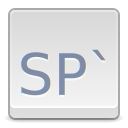
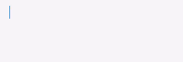

          

    

<h1 align="center">Snippet Pixie</h1>

    
    

    

Your little expandable text snippet helper.

Save your often used text snippets and then expand them whenever you type their abbreviation.

For example:- "spr\`" expands to "Snippet Pixie rules!"

For non-accessible applications such as browsers and Electron apps, there's a shortcut (default is Ctrl+\`) for opening a search window that pastes the selected snippet.

The Search and Paste window, opened with Ctrl+\` (can be changed), is very convenient for quickly finding and pasting snippets, and shows the most recently used snippets first for quick access. Using `Shift`+`Return` or `Shift`+`Click` on an entry in the Search and Paste window will `Shift`+`Ctrl`+`V` paste, great for terminal emulators, vim etc.

Snippets can be imported and exported in a simple JSON format.

Supports [placeholders](#placeholders):-

* **[Date/Time](#date):** Insert the current or calculated date/time with configurable format.
* **[Clipboard](#clipboard):** Insert the text contents of the clipboard.
* **[Snippets](#snippet):** Insert snippets in your snippets!
* **[Cursor](#cursor):** Set where the cursor should end up after the snippet has expanded.

## Placeholders

All placeholders are delimited (wrapped) by `$$`, with the placeholder name starting with an `@` symbol.

For example, today's date can be inserted with `$$@date$$`.

Some placeholders allow for extra arguments when `:` follows their name and that is followed by the argument. For example a format for a date, or the abbreviation for a snippet. Check the following descriptions for each placeholder for more details.

To use `$$` in your snippet body, escape the second `$` with a backslash like so: `$\$`.

### @date

Quick Examples:

* Today's date with system format: `$$@date$$`
* Today's date with custom format: `$$@date:%Y-%m-%d %H:%M:%S$$`
* Tomorrow's date with system format: `$$@date@+1D$$`
* Date 2 weeks from today with custom format: `$$@date@+2W:%x$$`
* Time 3 hours from now: `$$@time@+3H$$`

`@time` is an alias for `@date`, with one important difference, the default output if no format specified is the default time format (`%X`) rather than default date format (`%x`).

The optional format specified after `:` can take a format string as detailed in the [GLib.DateTime.format function's docs](https://valadoc.org/glib-2.0/GLib.DateTime.format.html).

The optional date calculation starts with an `@` after the placeholder name, followed by a signed integer and unit. The unit types are as follows:

* **Y:** Years
* **M:** Months
* **W:** Weeks
* **D:** Days
* **h:** Hours
* **m:** Minutes
* **s:** Seconds

You can apply more than one date calculation, for example `+2h+30m` adds 2 hours and 30 minutes to the current time.

You can use both positive (`+`) and negative calculations, for example `-3D` takes 3 days from the current date.

### @clipboard

When `$$@clipboard$$` is part of a snippet's body, when its abbreviation is expanded the current text contents of the clipboard will replace the placeholder.

### @snippet

You can have up to three levels of embedded snippets with the `@snippet` placeholder.

The abbreviation for the snippet to be embedded is entered after `:`, for example `$$@snippet:sigg;$$` expands the snippet with abbreviation `sigg;` in place of the placeholder.

### @cursor

Adding `$$@cursor$$` to a snippet's body will put the cursor in its place after expansion instead of at the end of the expanded text.

If `$$@cursor$$` is entered more than once in a snippet's body or via snippet embedding, then the last occurrence of the cursor placeholder wins.

## Known Issues

* Auto-expansion only works on accessible applications, use the shortcut to open the search and paste window for other applications such as browsers and Electron based apps.
* Auto-expansion does not work in terminals, but the shortcut method works with terminals that accept `Ctrl`+`v` for paste such as the elementary OS terminal.
* The cursor placeholder is not supported when using the shortcut method rather than auto-expansion.

## Roadmap

* ~~Automatically add to Startup apps~~
* ~~Export/Import snippets~~
* ~~Date/Time, clipboard, other snippets and cursor placeholders~~
* ~~Snippet search~~
* Group snippets?
* Undo/Redo of snippet edits
* Right To Left (RTL) language support
* Rich text?

## Building, Testing, and Installation

You'll need the following dependencies to build:
* meson
* valac
* appstream
* desktop-file-utils
* libatspi2.0-dev
* libgee-0.8-dev
* libglib2.0-dev
* libgranite-dev
* libgtk-3-dev
* libibus-1.0-dev
* libjson-glib-dev
* libsqlite3-dev
* libxtst-dev
* libx11-dev

Run `meson build` to configure the build environment and then change to the build directory and run `ninja test` to build and run automated tests

    meson build --prefix=/usr 
    cd build
    ninja test

There's also a convenient `01-setup.sh` script that should need only be run once to set up the `build` directory.

`02-build-bin.sh` is a neat way of building `build/com.github.bytepixie.snippetpixie` after changing the source while keeping the translation templates and language files up to date with any changes and running the automated tests.

To install, use `ninja install`, then execute with `com.github.bytepixie.snippetpixie`

    sudo ninja install
    com.github.bytepixie.snippetpixie
